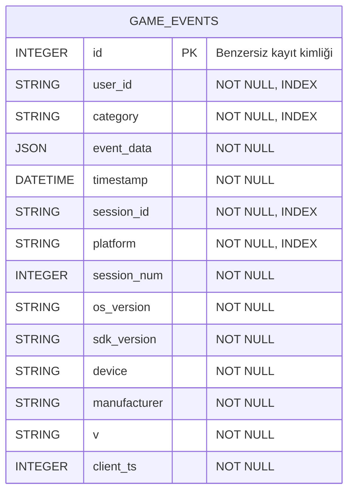

# Veritabanı Şeması

Startgate Telemetry API, oyunlardan gelen telemetri olaylarını
`game_events` tablosunda saklamaktadır.

Mevcut yapıda tek bir tablo bulunduğu için tablolar arası ilişki veya
foreign key bulunmamaktadır. `user_id`, kullanıcıyı tanımlayan bir alan
olmasına rağmen ayrı bir `users` tablosuna bağlı değildir.

## Game Events Tablosu

## Alan Açıklamaları

| Alan           | Açıklama                                                      |
| -------------- | ------------------------------------------------------------- |
| `id`           | Her telemetri kaydını benzersiz olarak tanımlayan primary key |
| `user_id`      | Olayı oluşturan kullanıcının kimliği                          |
| `category`     | Telemetri olayının kategorisi                                 |
| `event_data`   | Kategoriye özel verileri saklayan JSON alanı                  |
| `timestamp`    | Olayın sunucu tarafından kaydedildiği UTC zamanı              |
| `session_id`   | Olayın ait olduğu oturumun kimliği                            |
| `platform`     | İstemcinin çalıştığı platform                                 |
| `session_num`  | Kullanıcının oturum numarası                                  |
| `os_version`   | İstemcinin işletim sistemi sürümü                             |
| `sdk_version`  | Kullanılan telemetri SDK sürümü                               |
| `device`       | İstemci cihaz modeli                                          |
| `manufacturer` | Cihaz üreticisi                                               |
| `v`            | Oyun veya uygulama sürümü                                     |
| `client_ts`    | İstemci tarafından gönderilen Unix zaman damgası              |

## Tasarım Kararı

Bütün telemetri kategorilerinin ortak alanları normal kolonlarda
saklanmaktadır. Kategoriye göre değişen veriler ise `event_data`
isimli JSON kolonu içinde tutulmaktadır.

`event_data` içeriği veritabanına kaydedilmeden önce Pydantic
şemalarıyla doğrulanmaktadır. Ayrıca olay kategorisi ile kullanılan
`event_data` şemasının birbiriyle uyumlu olması zorunludur.
